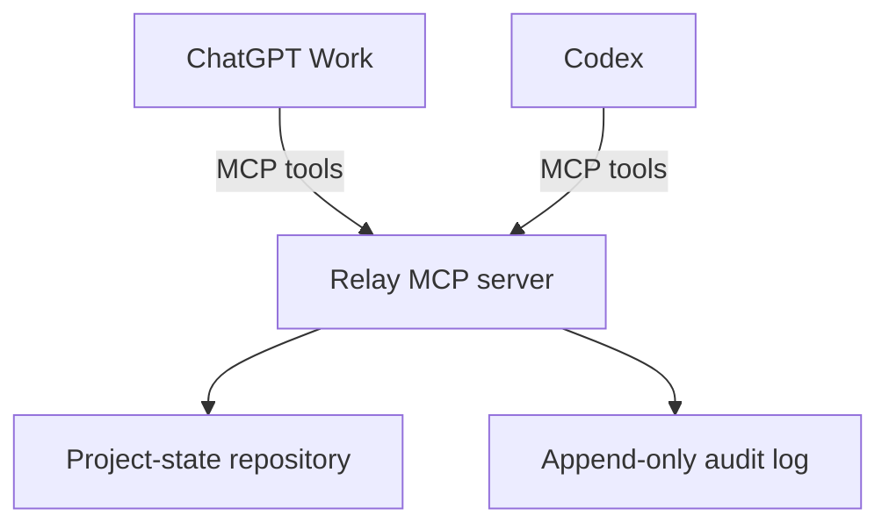

# Architecture

## Overview

Relay is a shared project-state service exposed through a remote-capable MCP server. ChatGPT Work and Codex are peer clients of the same bounded service. Neither client receives direct access to the other product's private chat store or memory system.



## Architectural decisions

### ADR-001: Explicit capsules instead of transcript synchronization

**Decision:** The originating model constructs a structured capsule from context already visible in its active conversation and submits it through an explicit mutation tool.

**Reasoning:** There is no need for the server to scrape private conversations. The approach is more portable, safer, smaller, and easier to validate.

### ADR-002: Provider-neutral domain core

**Decision:** Core entities use neutral terms such as project, handoff, checkpoint, artifact, principal, and source surface. OpenAI-specific logic belongs in adapters, plugin metadata, and setup documentation.

**Reasoning:** This reduces platform lock-in and supports later MCP clients without rewriting persistence.

### ADR-003: Append-only handoffs and checkpoints

**Decision:** Handoffs and checkpoints are immutable. Corrections create a superseding record with an explicit link.

**Reasoning:** Continuity requires traceability. Silent edits would make it impossible to know what context an agent actually received.

### ADR-004: Local-first proof, replaceable infrastructure

**Decision:** v0.1 uses a local Streamable HTTP server and SQLite behind repository interfaces. Authentication uses a development-safe principal mechanism compatible with the chosen plugin/tunnel path. Production adapters for OAuth and Postgres are deferred.

**Reasoning:** This proves the product loop without prematurely building a multi-tenant SaaS. Interfaces must prevent the local choices from leaking into the domain layer.

### ADR-005: No local execution capability

**Decision:** The MCP server stores and retrieves context only. It does not expose shell, filesystem write, Git mutation, or Codex-control tools.

**Reasoning:** Codex already has bounded local execution. Adding it to Relay would greatly increase the blast radius without helping prove continuity.

## Recommended repository shape

```text
relay/
  AGENTS.md
  README.md
  package.json
  pnpm-workspace.yaml
  apps/
    mcp-server/
      src/
      tests/
  packages/
    contracts/
      src/schemas/
      src/tool-contracts/
    domain/
      src/entities/
      src/services/
      src/ports/
    persistence-sqlite/
      src/
      migrations/
    test-support/
  plugin/
    README.md
    manifest-and-metadata-files-as-required-by-current-docs/
  docs/
    setup-windows.md
    setup-posix.md
    threat-model.md
    decisions/
  scripts/
  .env.example
```

The exact plugin file layout must follow current official OpenAI documentation rather than this placeholder directory name.

## Suggested technology choices

- TypeScript with strict compiler settings.
- A currently supported Node.js LTS runtime.
- Official or currently recommended MCP TypeScript SDK.
- Zod or an equivalent single-source runtime schema system.
- SQLite with explicit migrations and foreign keys enabled.
- Vitest or an equivalent fast test runner.
- Structured logging with redaction.
- Package manager chosen once and pinned through the repository metadata.

Codex must verify current versions and official recommendations before locking dependencies.

## Component responsibilities

### MCP transport adapter

- Implements Streamable HTTP.
- Performs initialization and tool registration.
- Converts domain errors into stable MCP-safe responses.
- Adds request ID, principal, and idempotency context.
- Applies request-size and rate limits.

### Application service

- Authorizes every project-scoped operation.
- Validates state transitions and invariants.
- Coordinates transactions, audit events, and idempotency.
- Produces compact model-oriented context views.

### Domain layer

- Defines entities and value objects.
- Contains no SDK, HTTP, SQLite, or OpenAI dependencies.
- Enforces immutable handoffs/checkpoints and supersession rules.

### Persistence adapter

- Implements repositories and transaction boundaries.
- Applies deterministic migrations.
- Stores structured JSON fields only after validation.
- Enforces user/project isolation at query boundaries.

### Plugin package

- Describes the product and its tools clearly.
- Provides server-wide instructions emphasizing explicit consent and compact capsules.
- Connects ChatGPT Work to the MCP endpoint through the currently supported development workflow.
- Contains no credentials.

## Persistence model

Minimum tables:

- `principals`
- `projects`
- `project_memberships`
- `handoffs`
- `checkpoints`
- `artifacts`
- `record_artifacts`
- `idempotency_keys`
- `audit_events`

All domain records use stable opaque IDs, UTC timestamps, and a schema version. Project slugs are unique per principal, not globally.

## Development authentication

For the personal proof of concept, use the narrowest supported development identity mechanism. It must produce a stable principal and reject missing or invalid credentials. Do not treat a user-provided `user_id` tool argument as authentication.

The authentication adapter must be replaceable with standards-based OAuth for hosted use. The development documentation must clearly label any limitations and must never recommend exposing an unauthenticated endpoint publicly.

## Idempotency and transactions

- Every mutation accepts an idempotency key in transport/request context or explicit input.
- The combination of principal, tool name, and idempotency key is unique.
- Replays return the original result.
- Payload mismatch under the same key returns a conflict.
- Domain write, audit event, and idempotency record commit atomically.

## Context compaction

The server is a source of truth, not a transcript dump. Aggregate responses should:

- prefer the latest active records;
- include concise summaries before detail;
- cap list sizes;
- expose stable IDs for drill-down;
- never invent resolutions for open questions;
- distinguish reported verification from unverified claims.

## Extension points

### Hosted deployment

Replace SQLite and development authentication with Postgres, OAuth, encrypted secrets management, tenant-aware rate limiting, and managed observability.

### Codex app-server companion

A later local companion may create or query Codex tasks with explicit user approval. Keep it outside the core MCP server so the context store remains useful and low-risk without local execution.

### Importers

User-provided exports may later be parsed into candidate handoffs. Imported content must remain clearly labeled and require confirmation before becoming active project state.

## Failure behavior

- Fail closed on authentication or authorization uncertainty.
- Reject invalid payloads before database writes.
- Return candidate projects on ambiguous lookup.
- Return partial-history indicators if response limits truncate data.
- Never fall back to scraping, filesystem search, or undocumented APIs.
- Preserve existing records if audit or idempotency writes fail by rolling back the transaction.

